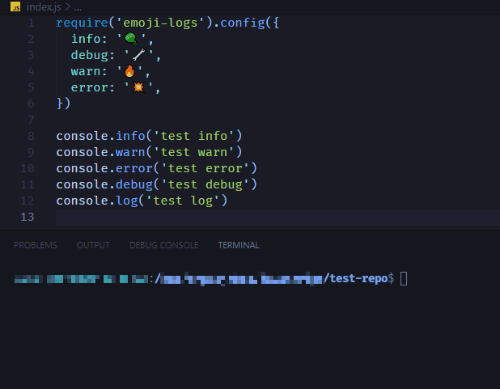
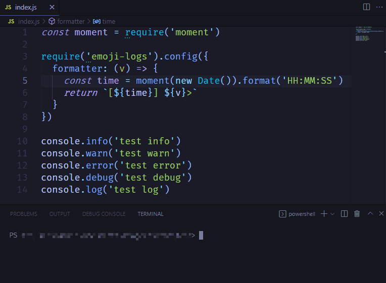

# emoji-logs

Emoji-logs is a zero-dependency module that marks certain console logs with emoji.

## Install

```bash
npm install emoji-logs
yarn add emoji-logs
```

## Usage

As early as possible in your application, require and configure emoji-logs.

```js
// CommonJS
require('emoji-logs').config({})

// JavaScript modules
import emojiLogs from 'emoji-logs'

emojiLogs.configure({})
```

## Config

### Change emoji

```js
require('emoji-logs').config({
  info: '🧶', 
  debug: '🔧', 
  warn: '🔥', 
  error: '💥',
})
```

### Change Formatter
```js
const moment = require('moment')

require('emoji-logs').config({
  formatter: (v) => {
    const time = moment(new Date()).format('HH:MM:SS')
    return `[${time}] ${v}>`
  }
})
```

## Example

### Default configuration


### Changed emojis



### Changed formatter


